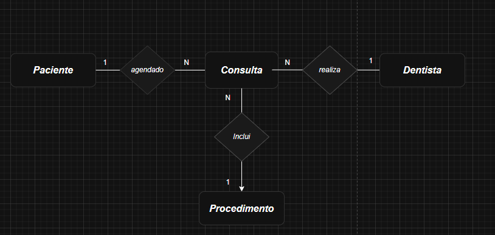
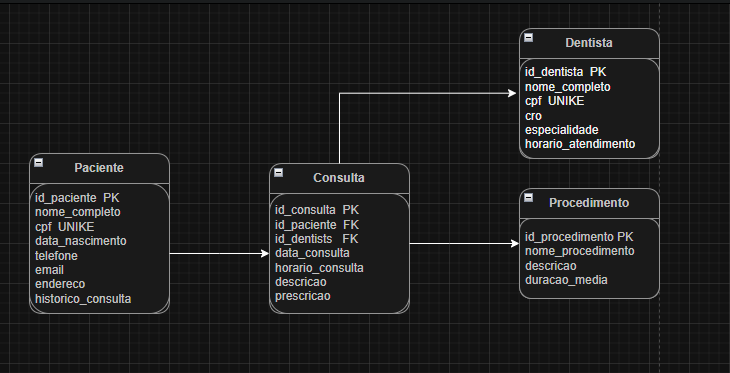

# Sistema Odontológico 🦷

Este projeto consiste no desenvolvimento de um banco de dados para gerenciamento de uma clínica odontológica. O sistema tem como objetivo organizar informações sobre pacientes, dentistas, consultas e procedimentos, permitindo o agendamento, controle e histórico de atendimentos. Dessa forma, a clínica pode otimizar sua gestão, garantindo eficiência no atendimento, acompanhamento de prescrições e monitoramento da agenda de profissionais.

## :hammer: Funcionalidades do projeto
- `Adicionar horarios de atendimento`: É possivel agendar consultas com dentistas
- `Cancelamento de Consultas`: É possivel cancelar consultas com dentistas em um prazo de ate 24 horas da data
- `Remarcação de Consultas`: Permite alterar a data e hora de uma consulta mantendo o vinculo entre o paciente e o dentista
- `Finalização de Consultas`: Atualizar o status, permitindo tambem adicionar observações, garantindo o historico para relatorios e estatisticas

## Modelos

### Modelo Conceitual


### Modelo Lógico


## Script SQL   
          
          
O script para criação do banco de dados, inserção de registros e consultas está disponível em [`script.sql`](./script.sql).

## 📁 Acesso ao projeto

```bash
# Clone este repositório
$ git clone "https://github.com/JoaoPedroDiasCoelho/trabalho-Banco_Dados"

# Acesse a pasta do projeto no terminal/cmd
$ cd trabalho-Banco_Dados
```

**Após baixar o projeto, abra no Dbeaver**

## 🛠️ Abrir e rodar o projeto
**Iniciar conexão em postgresql e abrir o script na conexão**

## Licença 
This project is [MIT licensed](./LICENSE).
